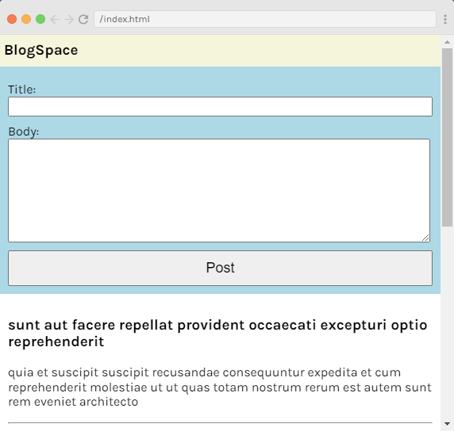
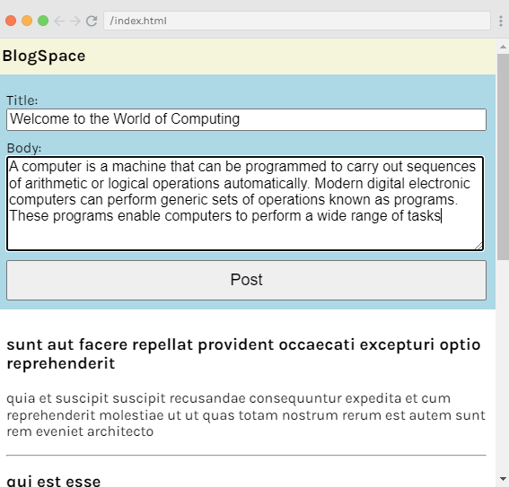
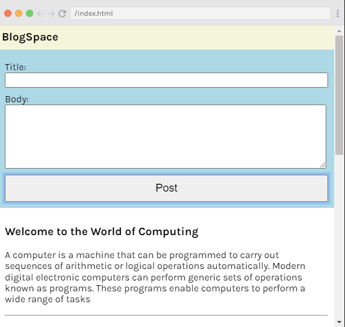

# URLs and APIs Project: BlogSpace

It is a JavaScript project named **BlogSpace** used to create blog posts and serve as a blog web application.







Quick start:

```
$ npm install
$ npm start
````

Happy Coding!
