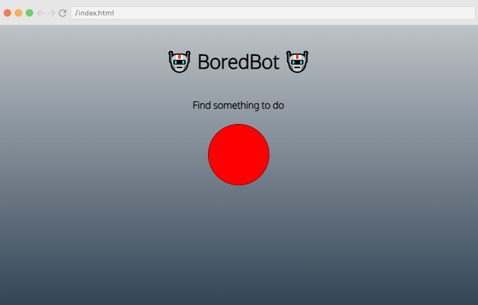
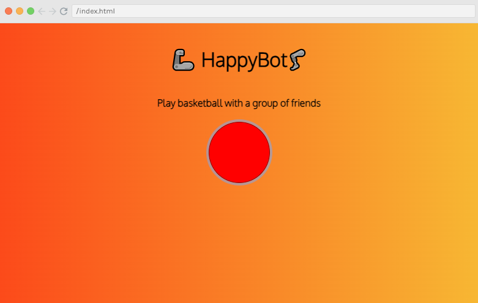
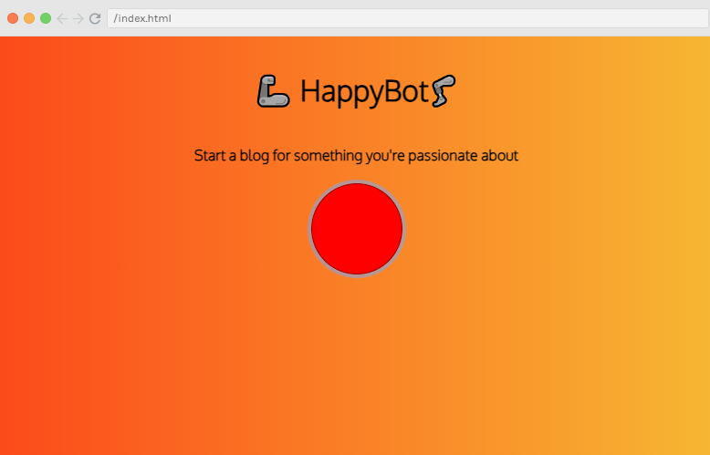

# Working with APIs Project: BoredBot

It is a simple web app which is made to get any random idea from a Bored API when button is clicked and appied beautiful styling on the background








Quick start:

```
$ npm install
$ npm start
````

Head over to https://vitejs.dev/ to learn more about using vite
## About Scrimba

At Scrimba our goal is to create the best possible coding school at the cost of a gym membership! 💜
If we succeed with this, it will give anyone who wants to become a software developer a realistic shot at succeeding, regardless of where they live and the size of their wallets 🎉
The Frontend Developer Career Path aims to teach you everything you need to become a Junior Developer, or you could take a deep-dive with one of our advanced courses 🚀

- [Our courses](https://scrimba.com/allcourses)
- [The Frontend Career Path](https://scrimba.com/learn/frontend)
- [Become a Scrimba Pro member](https://scrimba.com/pricing)

Happy Coding!
