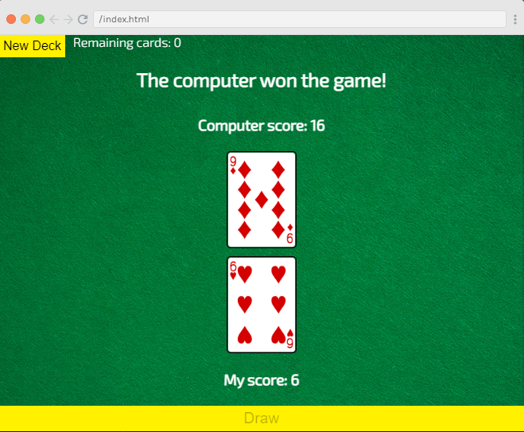

# Asynchronous JavaScript Project: Game of War

It is a Asynchronous JavaScript Project named **Game of War** that provides the functionality of game named game of war.




Quick start:

```
$ npm install
$ npm start
````


Happy Coding!
