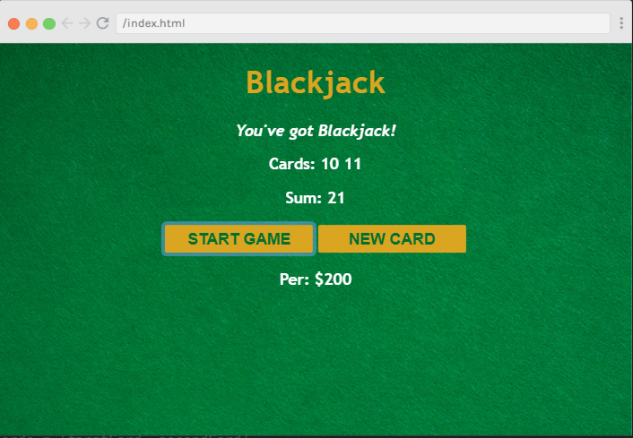

# JavaScript Project: Blackjack Game

## Description:
An amazing JavScript project created to provide the functionality of a famous Casino Game "Blackjack"

## Features:
This game provides different features that a Blackjack game provides:
- play game
- add new card
- win/lose
- beautiful interface
- player name and amount

## Output:

Happy Coding!
