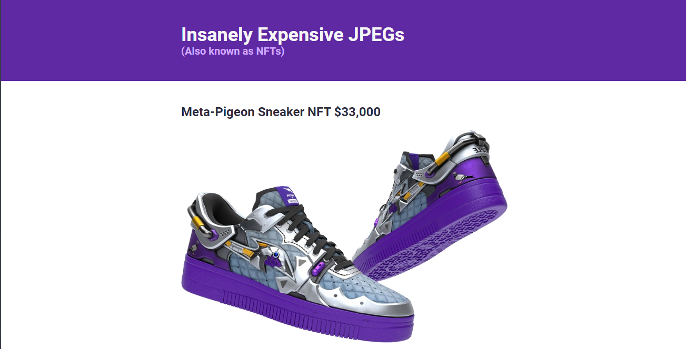
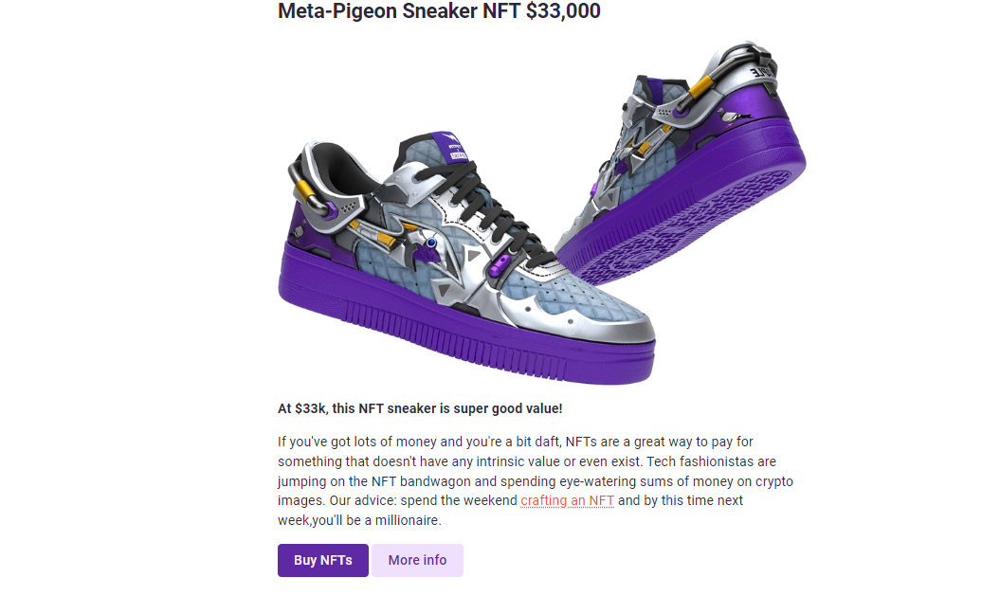
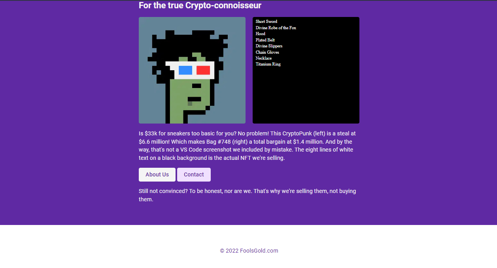

# Project: Building NFT Site

## Description:
It is kind of NFT Site which basically show informatin about products having all elements or sections that a full website has like Header, Main, Footer

## Tech Stack:
- HTML
- CSS

## Output:

<video src="NFT Site vide.mp4" controls="true" autoplay muted></video>

Happy Coding!
