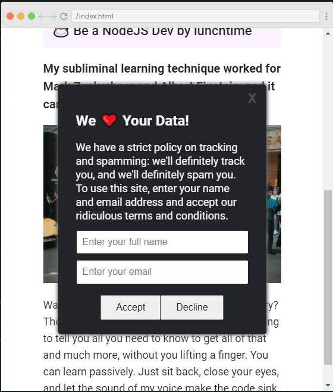
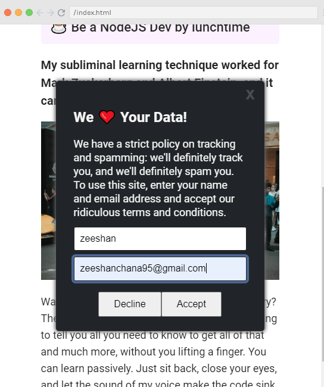
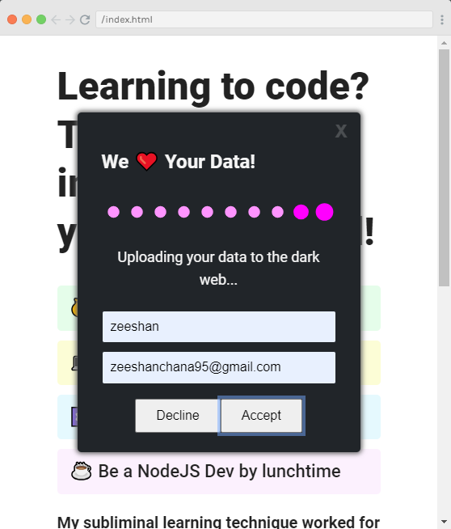
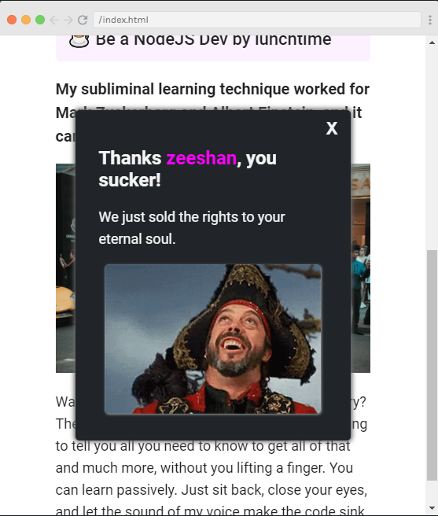

# Project: Cookie Consent

## Description:
It is mini project which is created to implement cookies section like websites use. It is created using HTML, CSS, JavaScript, Timer and JavaScript DOM.

## Features:
- take username and password from user
- show dialog box after submitting the form
- show the status of form is sending via message and a gif image
- show final popup after data sent successfully
- users can close the popup by pressing "X" button
- users can only accept cookies

## Tech Stack:
- HTML
- CSS
- JavaScript
- DOM

## Output:

Happy Coding!
